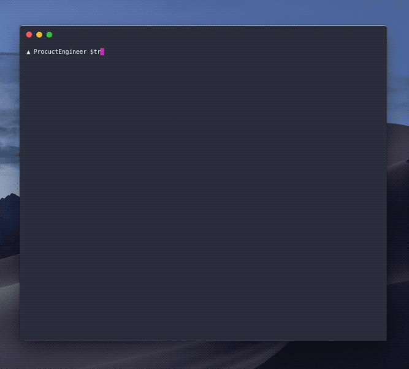

<p align="center">
    
</p>
<h1 align="center">
  gatsby-wordpress-migrate
</h1>


Migrate from Wordpress without pain! 

Huge community is migrating from Wordpress to Gatsby, especially developers. In order to migrate with ease and out of my pain I created this tool.

With `gatsby-wordpress-migrate` you can convert all your wordpress posts to gatsby-blog compatible in a fraction of a command. 


## 🚀 Quick start

**Install** this package globally or to your project with npm or yarn.

```sh
# Install gatsby-wordpress-migrate with yarn and make it a dev dependency
yarn add -D gatsby-wordpress-migrate
```

**Heads up**. To download all the Wordpress posts of yours, login tou your Wordpress dashboard, go to `Tools > Export` and then download export file with your posts.

**Run** the CLI commands with the following syntax.

```sh
wordpress2gatsby <XML filename> <destination folder>
# Example: wordpress2gatsby wordpressdata.xml content/blog
```


## 🧐 Example




## 🤟 Help it grow

You can jump in and contribute directly or file an issue in order to start exploring more opportunities/edge cases

To file the issue just follow the instructions 📃


<br/>
<br/>

---


<p align="center">
<sub><sup>Made with&nbsp&nbsp🧠 &nbsp&nbspby <a href="https://twitter.com/CostasAlexoglou">Product E:ngineer</a></sup></sub>
</p>
